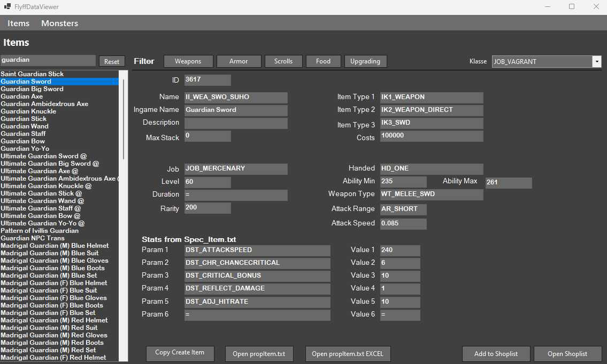

# FlyffDataViewer

## Why
I started this tool because i was sick of searching for items / Ids / Names in dozen different files. The existing GM Tools are not up-to-date so this tool looks for the files directoly in the Resource folder of your Server. 
It is far from beeing finished but it works for Items and movers so far. 

## Settings
In the same folder with the .exe file is a Settings.ini file which contains the resourcePath. Just add the Path to your Ressource Folder (don't add a backslash at the end) 
 
Following Files are needed (can be changed in ContentManager Load Functions):
- propMover.txt.txt
- propMover.txt
- defineObj.h
- Spec_Item.txt
- propItem.txt.txt
- defineItem.h

 

